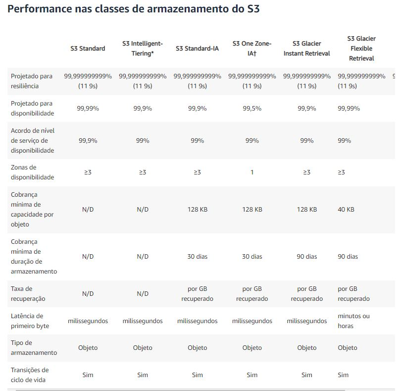

# S3 BUCKET
### Armazenamento de arquivos 

- O S3, no momento da criação, ele é global;
- O nome do bucket deve ser único de forma global;
- No momento da criação do bucket, você pode definir se ele terá acesso publico ou restrito;
- Escolhemos a região na hora da criação do bucket;
- Existe a possibilidade de copiar a configuração de uma bucket que já está criada;
- Toda vez que é feito um upload, é bom realizar o refresh pelo botão próprio para isso;
- O bucket cobra por download e não por upload;

## Por padrão, o upload é sempre feito no Storage Class Standard. 

### É Possível alterar o storage class na hora do upload do arquivo e também depois que o upload foi feito, porém a cada vez que você faz essa troca de storage class, você será cobrado. 

</br>

## Permissões ao Bucket S3
Temos as permissions e os acls (acess lists), quando você deixa as permissions publica, o seu bucket é protegido por um ACL e seus arquivos por outro ACL, ou seja, mesmo que o seu bucket esteja público, o acesso aos seus arquivos não estarão. 

Preciso definir uma lista de acessos (ACL) para o bucket. 

Com o S3 é possível fazer o versionamento dos arquivos, caso um arquivo seja excluído, alterado ou qualquer coisa do tipo, é possível buscar as versões anteriores. Isso acaba encarecendo o armazenamento, visto que para cada versão do arquivo, ele ocupa X valor de espaço. Então caso o arquivo tenha 10 megas e tenhamos 10 versões dele, estaremos ocupando 100 megas somente com um arquivo.
O mesmo ocorre quando deletamos um arquivo, o armazenamento continuará o mesmo, visto que o versionamento possui a característa de guardar o arquivo com a tag de "Delete marker". Caso remova essa tag, o arquivo voltará a ficar disponível para o usuário. Para deletar este arquivo em definitivo, é necessário deletar a a tag junto com todas as versões disponíveis. 

!!! ATENÇÃO !!! Uma vez que o versionamento foi habilitado, você não pode mais desabilitar, apenas suspender o uso. 

## Lifecycle Manager
Com essa opção, é possível gerenciar o ciclo de vida dos seus arquivos. Por exemplo, podemos escolher guardar somente as versões mais novas dos arquivos. As ultimas versões. Ou sempre o mais recente. Ou então alterar o storage class onde as versões mais antigas estão sendo armazenadas, fazendo assim o custo diminuir. 

- Antes de realizar essa mudança de storage class, precisa levantar quanto isso irá custar. Lembrando que toda vez que um arquivo já está armazenado em uma storage class e você move ele, acaba-se pagando por isso. 

- Quando definimos um tempo específico par ao arquivo ser removido, por exemplo: guarde as versões dos arquivos dos ultimos 30 dias e no dia 31, quando o arquivo for deletado, não há como restaurá-lo. É importante deixar claro essa politíca de exclusão.


## Criando um backup para o s3
Para criar um Cross Region do bucket, a regra de versionamento deve estar ativa no bucket que será "clonado". Lembrando que caso já haja arquivos dentro do bucket, ao ativar o "espelho" dele, os arquivos não são copiados automaticamente. Só serão gravados os arquivos nos dois, após a ativação da "replica" então, para que tudo seja replicado, é necessário forçar o comando via CLI. O camando é: 

``` aws s3 cp --recursive <bucket de origem> <bucket de destino> ```

``` aws s3 cp --recursive bucket-rlimanogueira bucket-rlimanogueira-bckp ```

Para que uma bucket acesse a outra, é necessário a criação de uma nova role. 

Quando você executa a função de delete, o arquivo não é excluído do bucket-bckp. 

### REDUCE REDUNCE STORAGE - RRS
Armazenamento do Amazon S3 que permite aos clientes armazenar dados reproduzíveis e que <b>não sejam de fundamental importância</b> com níveis de redundância mais baixos do que o armazenamento padrão do Amazon S3, em questão de durabilidade é importante ficar atento com esse tipo de armazenamento.
<b>Disponibilidade:</b> 99,99%
<b>Durabilidade:</b> 99,99%

### S3 Standard
Armazenamento do Amazon S3 que permite aos clientes armazenar dados reproduzíveis e que <b>não sejam de fundamental importância</b> com níveis de redundância mais baixos do que o armazenamento padrão do Amazon S3.
<b>Disponibilidade:</b> 99,99%
<b>Durabilidade:</b> 99,999999999%

### S3 INTELLIGENT-TIERING - S3 IT
Custo reduzido, movimentação de arquivos para níveis de acessos mais ecônomicos com base na frequência de acesso, sem impacto de performance, taxas de recuperação ou sobrecarga operacional. 
<b>Disponibilidade:</b> 99,99%
<b>Durabilidade:</b> 99,999999999%

### S3 Standard-Infrequent Access - S3 Standard IA
O S3 Standard-IA é indicado para dados acessados com menos frequência, mas que exigem acesso rápido quando necessários. A combinação de baixo custo e alta performance tornam a classe S3 Standard-IA ideal para armazenamento de longa duração, backups e datastores para arquivos de recuperação de desastres.
<b>Disponibilidade:</b> 99,99%
<b>Durabilidade:</b> 99,999999999%

### S3 One Zone-Infrequent Access - S3 One Zone-IA
O S3 One Zone-IA é indicado para dados acessados com menos frequência, mas que exigem acesso rápido quando necessários. Ao contrário de outras classes de armazenamento do S3, que armazenam dados em no mínimo três Zonas de disponibilidade (AZs), a S3 One Zone-IA armazena dados em uma única AZ, com um custo 20% inferior ao S3 Standard-IA. A classe S3 One Zone-IA é ideal para clientes que querem uma opção de menor custo para dados acessados com pouca frequência, mas não precisam da disponibilidade e da resiliência S3 Standard ou S3 Standard-IA.
<b>Disponibilidade:</b> 99,5%
<b>Durabilidade:</b> 99,999999999%

### S3 Glacier Instant Retrieval
A Amazon S3 Glacier Instant Retrieval é uma classe de armazenamento de arquivos que oferece o armazenamento de custo mais baixo para dados de longa duração, que raramente são acessados e exigem recuperação em milissegundos. Com a S3 Glacier Instant Retrieval, você pode economizar até 68% nos custos de armazenamento em comparação com o uso da classe de armazenamento S3 Standard-Infrequent Access (S3 Standard-IA), quando seus dados são acessados uma vez por trimestre. 
<b>Disponibilidade:</b> 99,9%
<b>Durabilidade:</b> 99,999999999%

### S3 Glacier Flexible Retrieval - S3 Glacier
O S3 Glacier Flexible Retrieval oferece armazenamento de baixo custo, custo até 10% menor (do que o S3 Glacier Instant Retrieval), para dados de arquivo que são acessados 1 a 2 vezes por ano e recuperados de forma assíncrona. Para dados de arquivo que não requerem acesso imediato, mas que precisam da flexibilidade para recuperar grandes conjuntos de dados sem nenhum custo, como casos de uso de backup ou recuperação de desastres, a S3 Glacier Flexible Retrieval (antiga S3 Glacier) é a classe de armazenamento ideal.
Tempos de recuperação configuráveis, de minutos a horas, com recuperações em massa gratuitas
<b>Durabilidade:</b> 99,999999999%

### S3 Glacier Deep Archive
A S3 Glacier Deep Archive é a classe de armazenamento mais acessível do Amazon S3 e oferece suporte à retenção e preservação digital de longo prazo para dados que podem ser acessados uma ou duas vezes por ano. Essa classe é projetada para clientes que mantêm conjuntos de dados por 7 a 10 anos ou mais para cumprir requisitos de conformidade regulatória, especialmente em setores altamente regulados como serviços financeiros, saúde e setores públicos.
Tempo de recuperação de até 12 horas
<b>Durabilidade:</b> 99,999999999%


